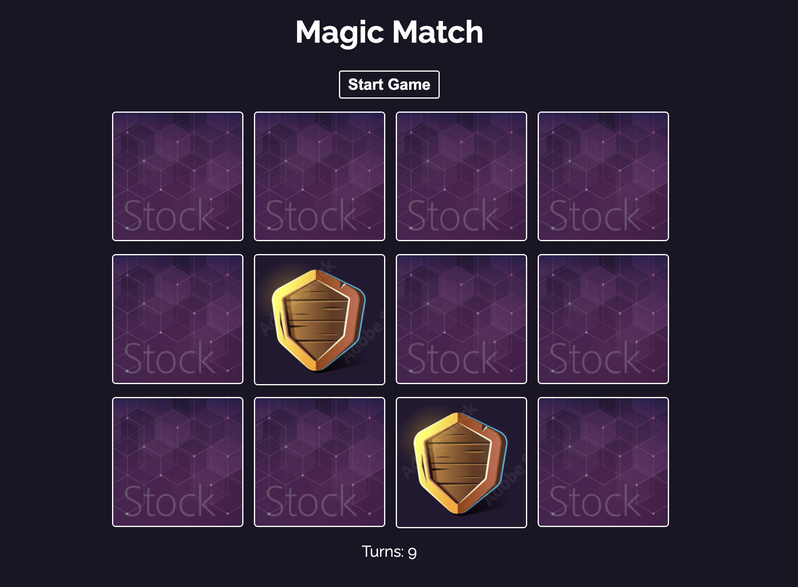

# Magic Match

This is a memory game where you have to match the cards.

# Project Screenshot

## Technologies used

- React
- CSS

## How to run the project

1. Clone the repository
2. Run `npm install` to install the dependencies
3. Run `npm run dev` to start the development server

## How to play the game

1. Click on a card to flip it over
2. Click on another card to flip it over
3. If the two cards match, they will be removed from the board
4. If the two cards do not match, they will be flipped back over
5. The game is won when all the cards have been matched

## How to win the game

1. Match all the cards
2. Click on the reset button to start a new game

## How to reset the game

1. Click on the reset button

## How to restart the game

1. Click on the restart button
